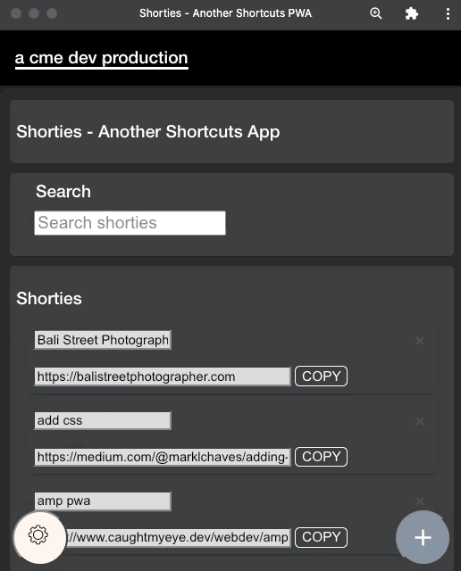
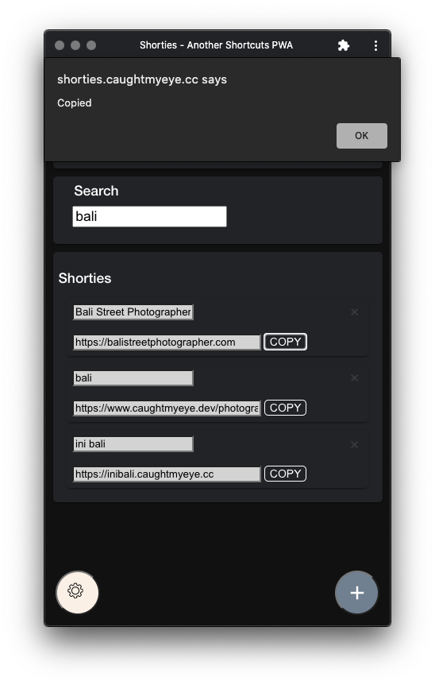
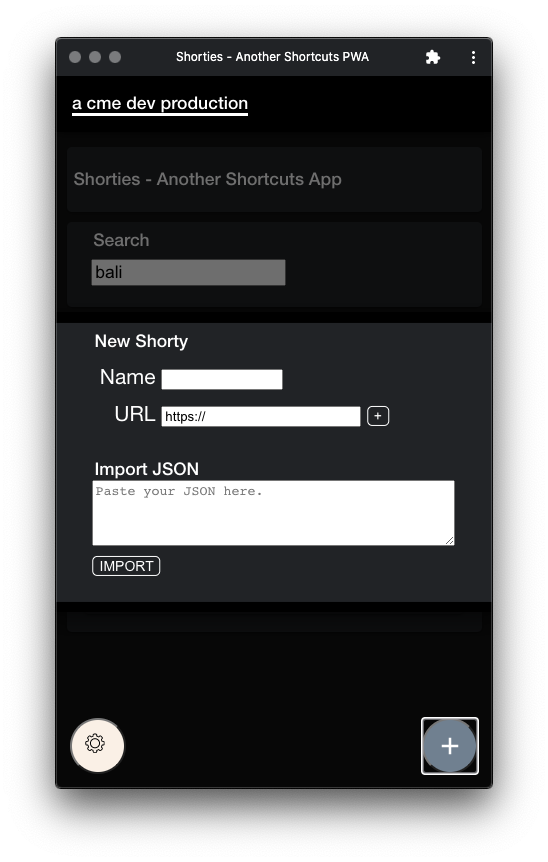
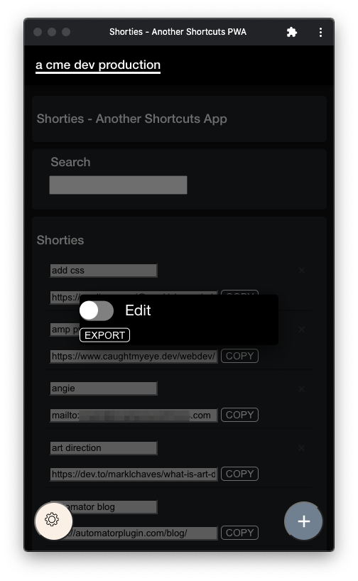
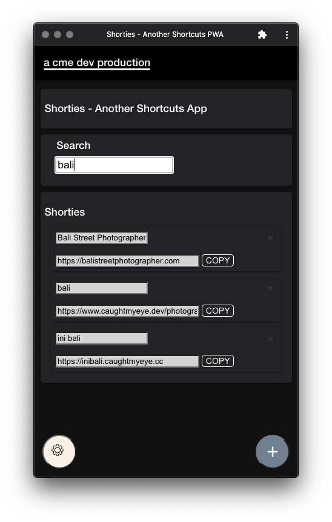

# Shorties Shortcut App

_Nice shorties!_ Quickly copy/paste your fave URLs without going to bookmarks or the browser. 

[Install](https://shorties.caughtmyeye.cc)

Based on _Your First Progressive Web App_ codelab.

Shorties is a Pregressive Web App (PWA) proudly developed on Glitch and hosted on Netlify.

---

## Motivation

This PWA will save you time. Use Shorties instead of:

1. Bringing up a browser, typing in a URL, and waiting for the page to load just to copy the link.
2. Bringing up a browser, opening up the bookmarks manager, searching for a bookmark and hoping it's in there, then finally copying the link of the bookmark.

---

## Features

1. Full CRUD (create, read, update, delete) support.
2. Export/import _shorties_ in JSON (JavaScript Object Notation) format. This means you can backup, restore, share, or sync your shortcut links with one file.
3. Case insensitive incremental search for real-time filtering.
4. Lightweight PWA (Progressive Web App).
5. Streamlined interface. E.g. auto saves once input field focus changes.
6. Freely available&mdash;no store purchase required.
7. Open source.

---

## Demo

---

## Screengrabs

### Copying a Shorty&mdash;What it's all about!

---

### Add Modal&mdash;Add and Import

---

### Tools Modal&mdash;Edit and Export

---

### Incremental Search

---

## Usage

### Install

1. Bring up [Shorties](https://shorties.caughtmyeye.cc) in Google **Chrome** on your desktop or laptop. When you see the `+` icon in your address bar, click it to install on your desktop. Try running ini bali with and without internet.
2. Bring up [Shorties](https://shorties.caughtmyeye.cc) in **Safari** on your iPhone. Press the share icon. Swipe up and press on **Add to Home Screen**. Run the app with and without internet on your iPhone.

### Add

1. Click the `+` icon in the lower right hand corner of the app.
1. Enter a Name and URL.
1. Click small + icon or hit enter

### Import

#### Import will overwrite everything. Export what you have first as a backup if needed.

1. Click the `+` icon in the lower right hand corner of the app.
1. Copy the contents of a properly formatted Shorties data [JSON file](shorties-example-data.json).
1. Click **IMPORT**.

### Copy

1. Click the **COPY** Button next to any Shorty.
1. Hit enter or click **OK** on the alert popup to copy the Shorty to the clipboard.

### Edit

1. Click on the _gear_ icon in the lower left hand corner of the app. 
2. Click the **Edit** toggle slider. The slider background turns orange. 
3. Click on the _gear_ icon again to dismiss the tools modal. The background colour of the Name and URL fields turn white and now are editable.
3. Hit the **tab** key to save or click on the _gear_ icon once more to disable edit mode.

Note: The list will automagically be sorted by the Shorty Name.

### Search

1. Begin typing in the Shorty Name in the **Search** field to filter the list of Shorties.
2. Clear the **Search** field to see all Shorties and to start a new search.

The search is case _insensitive_. E.g., A search on "Bali" and "bali" returns "Bali Street Photographer" and "ini bali - this is bali".

### Export

1. Click on the _gear_ icon in the lower left hand corner of the app. 
2. Click the **EXPORT** button. Save the file.
3. Click on the _gear_ icon again to dismiss the tools modal.

### Delete

#### You might want to export your list first.

Click the small `x` icon next any Shorty Name. The delete will take place immediately. There is **no** warning and no undo.

---

## Known Issues

Check the repo's [issues](https://github.com/marklchaves/shortcuts/issues) list.

These are the known issues at the time of writing.

1. Editing a search result creates a new entry instead of updating the existing. 
2. Dupe names and URLs are currently **allowed**. The search will only return the first hit on the name field only. Try to keep the names unique.
3. Deleting a _Shorty_ is instantaneous. There's no warning prompt.

---

## License

Copyright 2021 caught my eye, dev.

Licensed to the Apache Software Foundation (ASF) under one or more contributor license agreements. See the NOTICE file distributed with this work for additional information regarding copyright ownership. The ASF licenses this file to you under the Apache License, Version 2.0 (the “License”); you may not use this file except in compliance with the License. You may obtain a copy of the License at

[http://www.apache.org/licenses/LICENSE-2.0](http://www.apache.org/licenses/LICENSE-2.0)

Unless required by applicable law or agreed to in writing, software distributed under the License is distributed on an “AS IS” BASIS, WITHOUT WARRANTIES OR CONDITIONS OF ANY KIND, either express or implied. See the License for the specific language governing permissions and limitations under the License.

---

## I'll Drink to That ;-)

